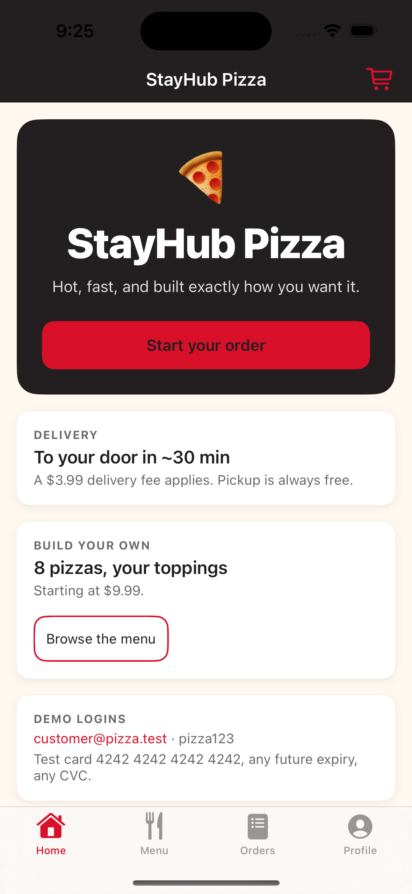

# pizza-ios-mobile

A native **SwiftUI** customer app for the Pizza demo, against the same Spring Boot API as the three
other frontends. Customer flows only — **there is no `/admin` here**, for the same reason the React
Native app has none: store management belongs on a desktop, and leaving it out keeps the diff
against `pizza-react-frontend` purely "native vs browser" rather than "different product".

It exists to be **read**. Where a "real production" choice and a "clear teaching example" choice
conflict, the teaching one wins and a comment says what production would do differently.



---

## Running it

```bash
# 1. the backend, in another terminal
cd ../pizza-springboot-backend && ./mvnw spring-boot:run     # :8085

# 2. the app
open Pizza.xcodeproj                                        # then ⌘R
```

`Pizza.xcodeproj` is committed, so there is nothing to install first. Swift Package Manager resolves
Stripe on the first build; that needs network access once.

| | |
|---|---|
| Minimum iOS | 17.0 (`@Observable` and the `Observation` framework) |
| Minimum Xcode | 15.4 |
| Swift | 5.10 |
| Dependencies | `StripePaymentSheet` only |

**On a physical device**, `localhost` is the phone, not the Mac. Set the Mac's LAN address in
`Config/Debug.xcconfig` — see the comment there; the `$()` escaping is not optional.

---

## Layered architecture

Dependencies point **inwards**. `Features` knows about `Domain`; `Domain` knows about nothing.

```
App/          composition root, routing, app lifecycle
  ├── PizzaApp.swift          @main, the scene-phase hook the cart's background flush needs
  ├── AppEnvironment.swift    the dependency graph, built once — read this first
  ├── AppRouter.swift         typed routes, one navigation stack per tab
  └── RootView.swift          tabs, the shared cart sheet, the toast overlay

Core/         no knowledge of pizza
  ├── Networking/             HTTPClient (protocol) · URLSessionHTTPClient · Endpoint · APIError
  ├── Persistence/            SecureStore (Keychain) · KeyValueStore · TokenStore (actor)
  ├── DesignSystem/           tokens, semantic theme, and the reusable components
  └── Utilities/              Money · ViewState · ActionOutcome · AppLog

Domain/       the business, with no idea how it is fetched or drawn
  ├── Models/                 Product · Cart · Order · User — plain Codable values
  ├── Services/               CartReducer (pure state machine) · CartPricing (pure)
  └── Repositories/           protocols only — the boundary Features depends on

Data/         how the domain is actually fetched
  ├── Endpoints/              every route in the app, as inert values
  └── Repositories/           the HTTP implementations, plus preview doubles

Features/     one folder per customer flow, each owning its state, screens and components
  Home · Menu · Cart · Checkout · Orders · Auth · Profile
```

### The five decisions worth knowing

| Decision | Why |
|---|---|
| **Repository protocols in `Domain`, implementations in `Data`** | Feature code never imports `URLSession` or `Endpoint`. Swapping the transport touches one folder; testing needs no server. |
| **A pure reducer for the cart** | `CartReducer.reduce` is a function from a value to a value. Its 15 tests run in microseconds with no app, no async and no main actor. The store next door is left holding only effects. |
| **`ViewState` instead of `isLoading` + `error` + `items`** | Three booleans describe eight combinations, five of which are nonsense. The enum makes them unrepresentable — including the eternal spinner that ships when the failure branch is forgotten. |
| **A `PaymentGateway` protocol with Stripe behind it** | Checkout is testable, previews render, and the SDK is confined to one file. |
| **A composition root, not singletons** | The whole dependency graph is one initialiser you can read. `AppEnvironment.preview()` swaps all of it for stubs. |

### State: three stores and per-screen view models

App-wide state is three `@Observable` stores injected through the SwiftUI environment — `AuthStore`,
`MenuStore`, `CartStore` — mirroring the React app's four customer contexts. There is no Redux
equivalent, because the thing that justified it there (`/admin`) is absent here.

Everything else belongs to one screen and lives in a view model beside it. A view model earns its
place where there is state with rules or derived values worth testing: `CheckoutViewModel` has both,
and `HomeView` has neither, so it has none. A codebase where *every* screen has a view model teaches
the wrong lesson.

---

## Testing

```bash
xcodebuild test -project Pizza.xcodeproj -scheme Pizza \
    -destination 'platform=iOS Simulator,name=iPhone 15'
```

**130 of 130 passing** in 0.65s, across 20 suites, covering the pure domain (money, pricing, the cart reducer, form
validation), the networking layer (through a real `URLSession` with a stubbed `URLProtocol`, so the
assertions are about the bytes that would actually be sent), the persistence layer, and every store
and view model against hand-written doubles.

There is no UI test target. The three web frontends are covered by Playwright suites that drive the
real flows; duplicating that here would test SwiftUI rather than this app.

---

## What is different from the other three frontends

The interesting comments in this codebase are mostly about *these*, and most of them name what the
web and React Native versions do about the same problem.

| Concern | Here | Elsewhere |
|---|---|---|
| **The session token** | iOS Keychain, `AfterFirstUnlockThisDeviceOnly`, read through an `actor` | `localStorage` on the web, with an apology; `expo-secure-store` in RN |
| **Reading it is async** | `AuthStore.isRestoringSession` gates the first frame | The web knows synchronously on first render |
| **Cancellation** | Structured concurrency: `.task` cancels its own work | `AbortController` threaded through every call by hand |
| **Losing the cart** | `scenePhase` → `CartStore.flushPendingWrites()`; a phone can be killed before a 300 ms debounce fires | A browser tab lives until it is closed |
| **Re-render control** | The framework compares view values; no `memo`, no `useCallback` | `React.memo` + `useCallback` on every list row |
| **Resetting a form** | `.sheet(item:)` builds a fresh view per item | A `key` counter bumped on open, to avoid an effect copying props into state |
| **Wrapping chips** | A hand-written `Layout` conformance | `flex-wrap: wrap`, one line |
| **Toasts** | An `.overlay` at the root | `createPortal`, to escape `overflow: hidden` |
| **Card entry** | Stripe PaymentSheet, native | `<PaymentElement>` on the web |

---

## Project generation

`Pizza.xcodeproj` is generated from `project.yml` and **both are committed**. The manifest is the
readable source of truth — a build setting changed there is one legible line in a diff, where the
same change made in Xcode's project editor is an opaque line in `project.pbxproj`.

```bash
brew install xcodegen
./Scripts/generate-project.sh
```

⚠️ Use the script, not `xcodegen generate` directly. XcodeGen 2.46 writes project format 77, which
**Xcode 15 refuses to open**, and it ignores its own `objectVersion` option. The script downgrades
to format 56 — which Xcode 16 reads perfectly well — and fails loudly if the project ever starts
using synchronized groups, which genuinely require 77.

## Formatting and linting

```bash
brew install swiftformat swiftlint
swiftformat .
swiftlint
```

---

## ⚠️ Xcode 15.4 cannot compile asset catalogues on macOS 26

On this machine — Xcode 15.4, macOS 26 (Darwin 25.2) — **every** asset catalogue fails to compile:

```
error: Failed to launch AssetCatalogSimulatorAgent via CoreSimulator spawn
    Description: AssetCatalogSimulatorAgent exited before we could handshake
```

`actool` compiles asset catalogues by spawning a helper *inside* a simulator runtime, and this
Xcode's CoreSimulator cannot spawn a host binary on this macOS — `xcrun simctl spawn booted <host
binary>` fails on its own with `LaunchdSimError 153`. It is not specific to this project: it hits
the app's own catalogue and all three of Stripe's, on the simulator SDK *and* the device SDK.

**Updating Xcode is the fix.** Until then, everything except asset compilation works, which is
enough to run the app and the tests:

```bash
# Temporarily drop the asset catalogue and the Stripe package, then build and run.
# The app falls back to a default icon; StripePaymentGateway takes its #if canImport else-branch
# and checkout renders its "Stripe SDK is not linked" copy.
```

The 130 tests and the screenshot above were produced that way. The committed configuration is the
correct one and is left intact.

## Known gaps, stated rather than hidden

- **Checkout does not offer saved cards.** Cards can be added and managed on the profile screen;
  wiring "pay with a saved card" is the natural next step. This is true of **all four** frontends.
- **No dark mode.** The app is pinned to light, matching the web frontends. `Theme` declares one
  palette; supporting both means a second one for every token.
- **The order history is one page of 20.** There is no pagination UI yet.
- **The demo credentials on the home and sign-in screens** are acceptable only because they are
  throwaway local fixtures. If this is ever pointed at real data, those cards are the first thing to
  delete.
